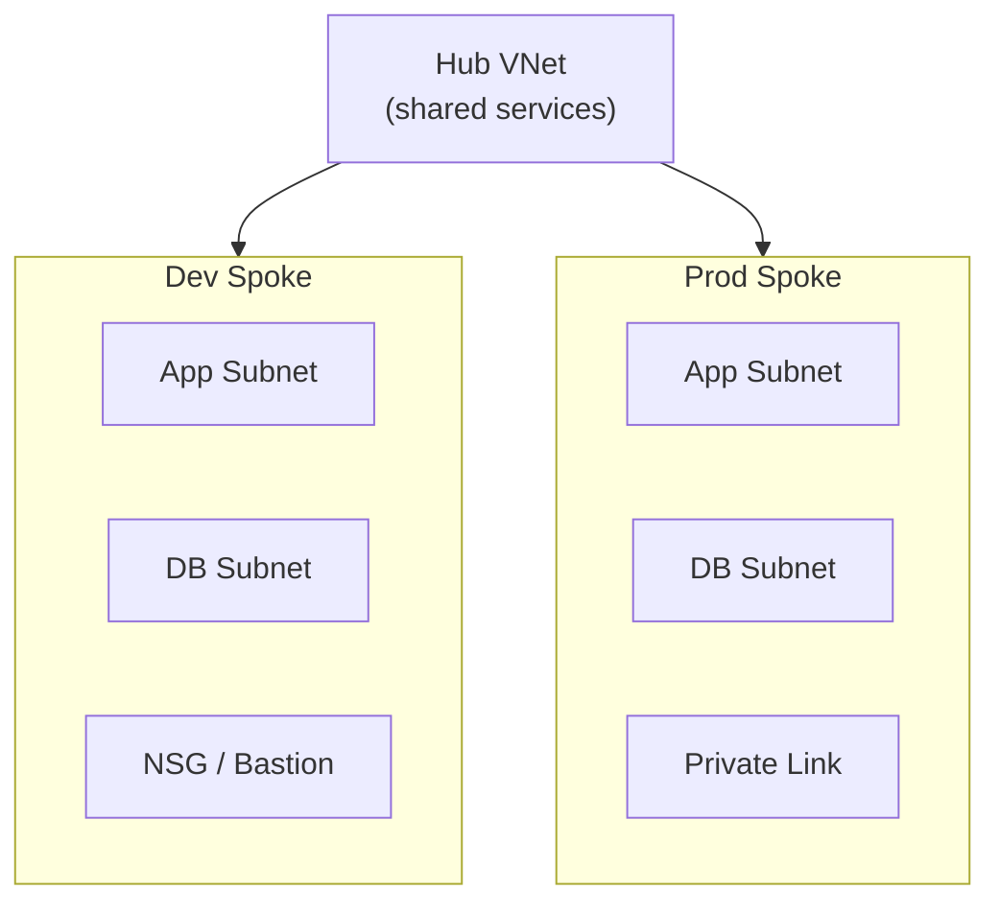
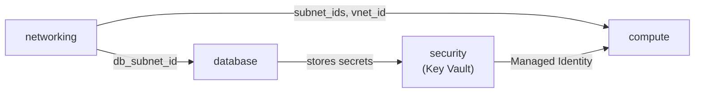

# Terraform Azure Infrastructure


Modular, reusable **Infrastructure as Code (IaC)** for deploying secure and scalable workloads on **Microsoft Azure**, with clean **Dev / Prod environment separation**, remote state, and a security-first design.

---

## Table of Contents

- [Highlights](#highlights)
- [Architecture](#architecture)
- [Repository Structure](#repository-structure)
- [Modules](#modules)
- [Prerequisites](#prerequisites)
- [Quick Start](#quick-start)
- [Environment Comparison](#environment-comparison)
- [Security Practices](#security-practices)
- [Contributing](#contributing)
- [License](#license)

---

## Highlights

- **Multi-environment layout**: separate `dev` and `prod` root configurations, each with its own state file and `.tfvars`.
- **Reusable modules**: parameterized building blocks for Networking, Compute, Database, and Security.
- **Security-first**: private endpoints, strict NSG rules, no public IPs on databases, secrets in Azure Key Vault, Managed Identity instead of hardcoded credentials.
- **Remote state with locking**: Azure Blob Storage backend, using blob leases to prevent concurrent applies.

---

## Architecture



### Module data flow



---

## Repository Structure

```
.
├── modules/
│   ├── networking/     # VNet, Subnets, Route Tables, NSGs
│   ├── compute/        # Virtual Machines / VMSS / AKS
│   ├── database/       # Azure SQL / PostgreSQL Flexible Server
│   └── security/       # Key Vault, Secrets, Managed Identities
│
├── env/
│   ├── dev/
│   │   ├── main.tf             # Module calls for dev
│   │   ├── variables.tf        # Input variables
│   │   ├── outputs.tf          # Exported IDs & endpoints
│   │   ├── terraform.tfvars    # Dev values
│   │   └── backend.tf          # Remote state config
│   └── prod/                   # Same layout, production SKUs & HA settings
│
├── .gitignore
├── LICENSE
└── README.md
```

---

## Modules

Each module is self-contained: it takes input variables and exposes outputs that other modules consume.

| Module | Purpose | Key outputs |
|--------|---------|-------------|
| `networking` | VNet, application/database subnets, NSGs, route tables | `vnet_id`, `subnet_ids` |
| `compute` | Virtual Machines, VMSS, or AKS; attaches a Managed Identity so no secrets are hardcoded | instance / cluster IDs |
| `database` | Azure SQL or PostgreSQL Flexible Server, kept off the public internet via Private Endpoint / VNet integration | server FQDN, ID |
| `security` | Key Vault, access policies / RBAC, secrets and certificates | `key_vault_id`, identity IDs |

---

## Prerequisites

- [Terraform](https://developer.hashicorp.com/terraform/install) `>= 1.5.0`
- [Azure CLI](https://learn.microsoft.com/cli/azure/install-azure-cli) `>= 2.50.0`
- An Azure subscription with **Contributor** or **Owner** access

---

## Quick Start

### 1. Authenticate with Azure

```bash
az login
az account set --subscription "<YOUR_SUBSCRIPTION_ID>"
```

### 2. Create the remote state backend

```bash
RESOURCE_GROUP="rg-terraform-tfstate"
STORAGE_ACCOUNT="tfstate$(openssl rand -hex 4)"
CONTAINER_NAME="tfstate"

az group create --name $RESOURCE_GROUP --location centralindia
az storage account create \
  --name $STORAGE_ACCOUNT \
  --resource-group $RESOURCE_GROUP \
  --sku Standard_LRS \
  --encryption-services blob
az storage container create \
  --name $CONTAINER_NAME \
  --account-name $STORAGE_ACCOUNT
```

Then update `env/<target>/backend.tf`:

```hcl
terraform {
  backend "azurerm" {
    resource_group_name  = "rg-terraform-tfstate"
    storage_account_name = "<STORAGE_ACCOUNT_NAME>"
    container_name       = "tfstate"
    key                  = "terraform.<env>.tfstate"
  }
}
```

### 3. Deploy

```bash
cd env/dev

terraform init        # initialize providers & backend
terraform validate    # check configuration
terraform plan  -var-file="terraform.tfvars"
terraform apply -var-file="terraform.tfvars"
```

### 4. Clean up

```bash
terraform destroy -var-file="terraform.tfvars"
```

---

## Environment Comparison

| Dimension | Dev | Prod |
|-----------|-----|------|
| High availability | Single zone, standard storage | Multi-zone (ZRS), Premium SSD |
| Compute sizing | Burstable (e.g. `Standard_B2s`) | Optimized (e.g. `Standard_D4s_v5`) |
| Data protection | Soft delete, short retention | Geo-redundant backups, 30-day retention |
| Network security | Optional bastion / jump host | Strict private endpoints, hub-spoke isolation |

---

## Security Practices

- No hardcoded secrets, subscription IDs, or CIDRs inside modules.
- Databases are never exposed with public IPs.
- Secrets live in Azure Key Vault and are accessed through Managed Identity.
- State files are stored remotely and excluded from Git via `.gitignore`.

---

## Contributing

1. Fork the repo and create a feature branch.
2. Run `terraform fmt -recursive` before committing.
3. Make sure `terraform validate` passes in both `env/dev` and `env/prod`.
4. Keep modules fully parameterized.
5. Open a pull request with a clear description of the change.

---

## License

Distributed under the **MPL-2.0** License. See [LICENSE](LICENSE) for details.

---

## Author

**Ayush Agrawal**: DevOps / DevSecOps Engineer
[Email](mailto:architectayush3@gmail.com) · [GitHub](https://github.com/architectayush3-stack)
